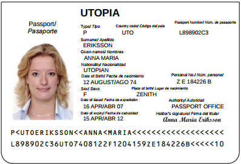

# MZR Generator

## Description:
MZR Generator is a universal Machine Readable Zone generator for all modern passports and others official travel documents.

Several modules have also been created that work with many national identity documents (For now it only supports spanish DNIe, DNI and NIE)

MZR Generator is built according to International Civil Aviation Organization specifications (ICAO 9303):
- Specifications Common to all Machine Readable Travel Documents (MRTDs)
- Specifications for Machine Readable Passports (MRPs)

## Usage:
To generate the MZR code it's necessary to know the following data:
- Document type
- Country code (3 letters)
- Holder surname(s) and given name(s)
- Passport number
- Nationality code (3 letters)
- Birth date
- Gender
- Document expiry date
- Identification number (optional)

##### ICAO9303 Specimen:

Note: She is a fictional women from a fictional country (Utopia), but the example is very similar to real passports.

##### MRZ Code command:
`print(PassportCodeGenerator("P", "UTO", "Eriksson", "Anna Maria", "L898902C3", "UTO", "740812", "F", "120415", "ZE184226B"))`

##### MRZ Code output:
```
P<UTOERIKSSON<<ANNA<MARIA<<<<<<<<<<<<<<<<<<<
L898902C36UTO7408122F1204159ZE184226B<<<<<10
```

## Features:
- Hashes computation
- String validation, raising an exception in case of error.
- Transliteration of special latin characters (acutes, tildes, diaeresis, graves, circumflex, etc)
- Case insensitive
- Padding function
- Automatic hash computation for spanish identity national document (DNIe, and DNI)
- Automatic hash computation for spanish foreigner identification number (NIE)
###### TODO:
- Transliteration of cyrillic characters.
- Transliteration of arabic characters.
- Country code generation.
- Generation of country code from the country name (Ex. Netherlands: "NLD")
- Name truncation

## Known bugs:
- Padding failure when establishing given names outside the instance
